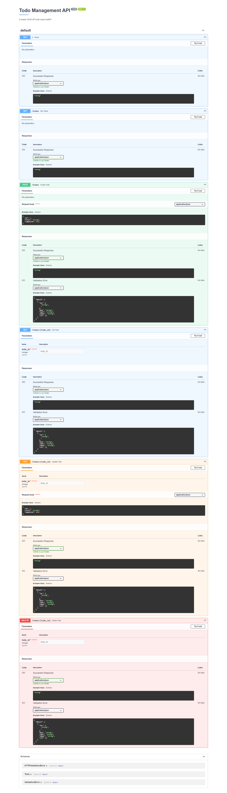

# FastAPI Todo CRUD API 🚀


A production-ready **Todo Management REST API** built using **FastAPI** and **Pydantic**, implementing complete **CRUD (Create, Read, Update, Delete)** operations with interactive Swagger documentation for API testing.

---

## Overview

This project demonstrates the implementation of RESTful API development using FastAPI.
It allows users to create, fetch, update, and delete todo tasks efficiently.

The API includes:

* Request validation using Pydantic
* CRUD endpoint implementation
* Duplicate ID validation
* Interactive API documentation (Swagger UI)
* Clean and modular backend structure

---

## Features

✔ Create new todos
✔ Retrieve all todos
✔ Retrieve todo by ID
✔ Update existing todos
✔ Delete todos
✔ Validate request data using Pydantic
✔ Automatic API documentation

---

## Tech Stack

| Technology | Purpose                   |
| ---------- | ------------------------- |
| Python     | Core programming language |
| FastAPI    | Backend framework         |
| Pydantic   | Data validation           |
| Uvicorn    | ASGI server               |

---

## Project Structure

```bash
fastapi-todo-crud-api/
│
├── main.py
├── requirements.txt
├── README.md
└── screenshots/
    └── crud-demo.png
```

---

## Installation & Setup

### Clone Repository

```bash
git clone https://github.com/Rohitarya0605/fastapi-todo-crud-api.git
```

### Move into Project Directory

```bash
cd fastapi-todo-crud-api
```

### Install Dependencies

```bash
pip install -r requirements.txt
```

### Run Application

```bash
uvicorn main:app --reload
```

Server will start at:

```bash
http://127.0.0.1:8000
```

---

## API Documentation

FastAPI automatically generates interactive API docs.

### Swagger UI

```bash
http://127.0.0.1:8000/docs
```

### ReDoc

```bash
http://127.0.0.1:8000/redoc
```

---

## API Endpoints

| Method | Endpoint           | Description      |
| ------ | ------------------ | ---------------- |
| GET    | `/`                | Home Route       |
| POST   | `/todos`           | Create Todo      |
| GET    | `/todos`           | Fetch All Todos  |
| GET    | `/todos/{todo_id}` | Fetch Todo by ID |
| PUT    | `/todos/{todo_id}` | Update Todo      |
| DELETE | `/todos/{todo_id}` | Delete Todo      |

---

## Example Request Body

```json
{
  "id": 1,
  "title": "Learn FastAPI",
  "completed": false
}
```

---

## Working Demo

### Swagger Interface


This interface allows real-time API testing directly from the browser.

---

## Sample Response

```json
{
  "message": "Todo created successfully",
  "data": {
    "id": 1,
    "title": "Learn FastAPI",
    "completed": false
  }
}
```

---

## Future Improvements

* SQLite Database Integration
* SQLAlchemy ORM
* JWT Authentication
* Docker Containerization
* Cloud Deployment
* CI/CD Pipeline

---

## Learning Outcomes

Through this project, I gained practical experience in:

* REST API Development
* Backend Architecture
* FastAPI Framework
* Request Validation
* CRUD Operations
* API Testing with Swagger

---

## Author

**Rohit Arya**
B.Tech Electronics & Communication Engineering
MIT ADT University, Pune


---
